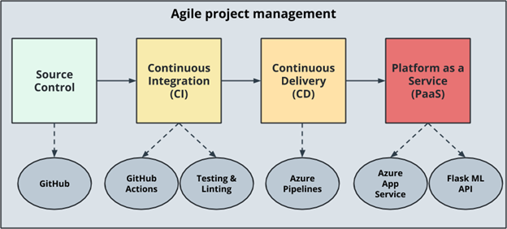
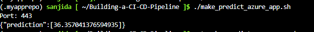

# Overview
In this project, a CI/CD Pipeline is built which included a Python Web Application using Flask and sklearn and deployed it using Azure App Services. 
A pre trained, sklearn model has been trained to predict the housing prices in Boston according to several features, such as average rooms in a home, data about highway access, teacher-to-pupil ratio, and so on.

# Project Plan
•	A link to a Trello board for the project
https://trello.com/invite/b/B4AYDcB7/3ce49926f830b0729df4f8a785888944/building-a-ci-cd-pipeline-project

•	A link to a spreadsheet that includes the original and final project plan
https://docs.google.com/spreadsheets/d/1H3sP9IoXakEOkfpejzhj_wSk_M5urcBSkDJ1CAvIIeg/edit?usp=sharing

# Instructions

An Architectural diagram is shown in fig. Here, first a source control needs to be setup. In this project, the source control will be through GitHub. In GitHub it is possible to make modification and those modifications are also possible to automate using Continuous Integration. The code will always be checked automatically in Continuous Integration using GitHub Action and this GitHub actions has a great support for building testing and linting. After testing the final step will be the Continuous Delivery which ensures that it is delivered automatically using Azure Pipelines. Azure Pipelines will be connected to Azure App Services and deploy the Flask Application.

# CI: Set Up Azure Cloud Shell:
To create a communication between Azure cloud shell and GitHub, a SSH key is generated using the following command:

ssh-keygen -t rsa		

<h3>Creating Project Scaffolding:</h3>
A makefile is a handy way to create shortcuts to build, test, and deploy a project. So, in this step all the project scaffolding including makefile, requirements.txt, script file and test file are created. Another important task at this step is to create a virtual environment. Virtual environment let us know what installation tool we are using. The following commands are used to create a virtual environment.

python3 -m venv ~/.myrepo

source ~/.myrepo/bin/activate

After running the command “make all” from the makefile, the passed test is shown below:

# CI: Configure GitHub Actions:

Configuring GitHub Actions is a necessary step to perform Continuous Integration remotely. The given code is pasted in the yaml file as per the project criteria and both the lint and test steps are successfully passed.

# Continuous Delivery on Azure:
This is the final step which involves setting up azure pipelines to deploy the Flask starter code to Azure App Service. 

An app service is created and initially deployed in the Cloud Shell.

A successful load test of application using Locust is performed.

A prediction was run against a working deployed Azure Application.

The prediction successfully returns back a JSON payload.

A successful run of the project in Azure Pipeline:

Output of streamed log files from deployed application:

# Enhancements
This project could be extended to any pre-trained machine learning model, such as those for image recognition and data labeling.

# Demo
https://youtu.be/-ne-upnGy2U

